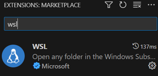
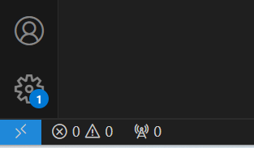
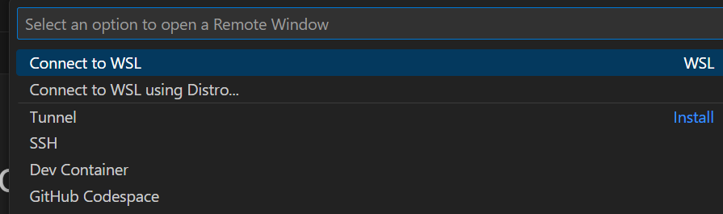

# How to Build EDK
前面幾個章節都是分享自己知道的理論知識, 接下來要進入實際操作的部份了.<br>
我知道每家IBV(Independent BIOS Vendor)都有自己的工具及特定語法來縮知開發時間.<br>
但由於有版權問題, 這裡我選擇用Open Source的EDK及微軟的WSL來完成.<br>
若是喜歡GUI的朋友也可以直接安裝完整版的Ubuntu.<br>

## WSL
在Windows內執行Linux的方法之一, 好處是硬體不需要像使用Virtual Box等類的軟體那麼高,<br>
詳細的安裝方式請參考微軟的文件.<br>
[如何使用 WSL 在 Windows 上安裝 Linux](https://learn.microsoft.com/zh-tw/windows/wsl/install)

## VsCode
Linux下編寫程式的IDE有很多種, 我個人最喜歡的還是用VSCODE.<br>
在Windows的環境下, VSCODE可以直接連結到WSL中, 不需另外再啟動Terminal.<br>
當VSCODE及WSL都安裝完成之後, 可以透過Extension來為VSCODE安裝由微軟發行WSL擴充模組.<br>
<br>
安裝完成後可以透過左下角的Open a Remote Window來選擇要啟動哪個WSL<br>
<br>
因為我的系統只有一個WSL, 所以選第一個就可以了.<br>
<br>
接著啟動Terminal.<br>
<br>

在Terminal中輸入"sudo apt update"來更新取得軟體的路徑, 接下來參考底下文章取得EDK及build code設定.<br>
[Using EDK II with Native GCC](https://github.com/tianocore/tianocore.github.io/wiki/Using-EDK-II-with-Native-GCC)<br>
我們的WSL是Ubuntu, 因此選Ubuntu的來看就好, 要注意的是底下指令要修正一下
```
sudo apt-get install build-essential uuid-dev iasl git gcc nasm python3-distutils
```
<br>
用git把EDK的code下載完後實際上還是會缺少一些檔案, 例如會缺少BrotliCompress, <br>
這時只要去github上EDK的repository中點選缺少檔案的路行後下載即可, 如
<br>
*BaseTools/Source/C/BrotliCompress*
<br>
最後, 我們最終目的是寫一些shell下的小工具, 不需要build整個EDK, 因此用底下指令會比較快.

*build -a X64 -t GCC5 -p ShellPkg/ShellPkg.dsc*


