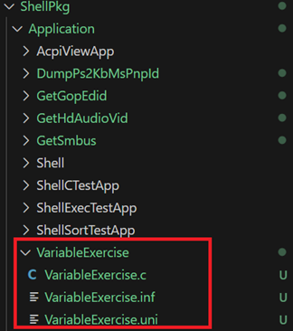

# Variable概念
在UEFI的世界中, Variable與C的Variable相同, 都是用來存儲資料的. 
但是在BIOS中有些設定是必須被儲存起來, 下次開機時可以直接拿來用, 因此我們把這些設定值 
稱為variable, 透過runtime service中GetVariable及SetVariable來使用. 

現在我們開始練習吧
## 建立資料夾
在底下圖片的位置建立VariableExercise資料夾. 

