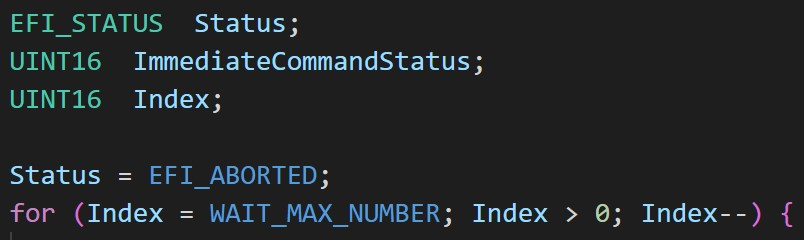
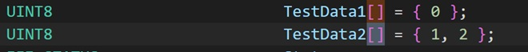

# 1.變數型態
## 簡易型態
C語言是強型態語言, 因此變數型態是相當重要的, UEFI的簡單的變數型態可在ProcessorBind.h中找到, 
其中較為特殊的是UINTN, 這個型態是根據Compilier不同而有不同的大小, 一般來說, 它等同於UINT64.
底下為例子</n>

我們宣告了一個型態為UINT16的變數, 它的名字叫Index, 這種型態的變數使用上只需注意型態的轉換. 
如果要把上述的Index轉成UINT32, 那就直接在前面加上(UINT32)Index就好.

## 陣列(Array)
一個完整功能的程式一定會宣告許多相同型態的變數, 但是過多的變數也會降低程式的可讀性, 也會增
加日後維護的困難. 因此我們可以把相同型態且有相同功能的變數匯集成一個陣列, 如下圖</n>

宣告陣列時元素數量可加可不加.

## 指標(Pointer)
在UEFI中大量使用指標, 因此了解指標的使用方式就相當重要了.</n>
'''
UINT8 *Data8 = NULL;
'''
## 結構(Struct)
## 聯合(Union)
## 結構指標(Struct Pointer)

